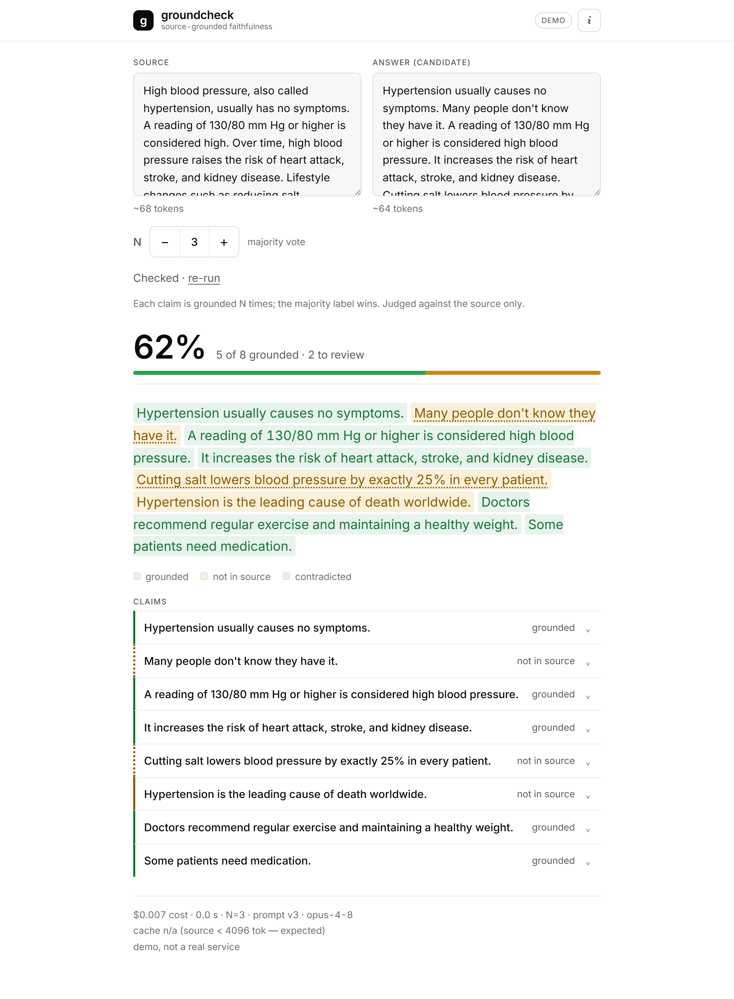

# groundcheck — a source-grounded faithfulness verifier

**Does this AI answer actually say what the source supports — or did it make things up?**
groundcheck takes a *source* document and a *candidate answer*, breaks the answer into
atomic claims, adjudicates each one **against the source only** as
`SUPPORTED` / `CONTRADICTED` / `NOT_ENOUGH_INFO`, and returns a single **faithfulness
score** plus per-sentence green/amber/red highlighting and a per-claim confidence.

It is **not a chatbot** — it is a *verifier*. And it ships with the part most "LLM
graders" skip: a **two-tier meta-eval** that measures whether the detector's own
verdicts agree with human labels (precision / recall / F1 / Cohen's κ). The reliability
of the tool is *shown*, not asserted.

> Faithfulness ≠ truth. groundcheck judges *"is this grounded in the provided source"* —
> the RAG-grounding contract — not *"is this true in the world."* A statement that is
> true in reality but absent from the source is `NOT_ENOUGH_INFO` **by design** (§2).

---

## The money demo

Paste a source + an AI answer, hit **Check**, and every sentence lights up — **green**
(grounded), **amber** (not in the source), or **red** (contradicted) — with the
supporting span, a one-line rationale, and a per-claim vote. The fabricated sentences
turning amber on screen *is* the pitch.



The healthcare answer above is mostly faithful but slips in two fabrications — *"lowers
blood pressure by exactly 25% in every patient"* and *"the leading cause of death
worldwide"* — neither of which the source states. groundcheck scores it **62%** (5 of 8
claims grounded) and marks exactly the three unsupported sentences amber.

**Reproduce it with no API key:**

```bash
pip install -e "./core[dev]" -e "./api[dev]"
./scripts/dev.sh            # or: pwsh scripts/dev.ps1   →  http://127.0.0.1:8000/
```

Open the URL, click **Check faithfulness** → 62%, three amber marks. The web demo runs
on a deterministic `MockProvider`, so it needs no key and is byte-stable. (The same frame
is asserted in CI by `e2e/test_money_demo.py`.)

---

## Architecture

Four small layers; `core` is a pure, importable engine and everything else depends on it.

```text
  ┌───────────────────────────────────────────────────────────────────────┐
  │  core/   the engine — `from groundcheck import check`                  │
  │          decompose (Sonnet 4.6) → ground ×N (Opus 4.8) → score+highlight│
  │          pure Python + pydantic; no key to import; provider seam        │
  └───────────────────────────────────────────────────────────────────────┘
        ▲                      ▲                         ▲
        │ imports directly     │ thin HTTP adapter       │ imports directly
        │                      │                         │
  ┌───────────┐        ┌────────────────┐        ┌──────────────────────────┐
  │  eval/    │        │  api/          │        │  app/                    │
  │ two-tier  │        │ FastAPI:       │        │ single-file dc-html UI    │
  │ meta-eval │        │ POST /check    │◄──serves│ fetch('/check') → animate │
  │ on gold   │        │ + static app   │ same-   │ green/amber/red, scores   │
  │ datasets  │        │ (no CORS)      │ origin  │                          │
  └───────────┘        └────────────────┘        └──────────────────────────┘
```

- **`core`** — the orchestrator (`pipeline.check`) is an in-process function. No
  service-to-service HTTP; the CLI, the API, and the eval harness all import it directly.
  `import groundcheck` loads no SDK and needs no key (providers import lazily).
- **`api`** — a *thin* adapter: validate → call `check()` → map errors to clean JSON.
  It serves the static `app/` **same-origin** under `/app`, so the page `fetch`es
  `/check` with no CORS.
- **`app`** — the demo UI (no build step). Marks one span per claim; surfaces every
  edge state (loading / error / missing-key / N/A / refusal / borderline / unlocated).
- **`eval`** — the meta-eval. Imports `core` directly, delegates **all** metric math to
  `groundcheck.metrics`, and is the only layer that ships the gold datasets.

---

## Quickstart

```bash
# 1. install the engine (and the API, for the web demo)
pip install -e "./core[dev]" -e "./api[dev]"

# 2. the no-key money demo — CLI (deterministic mock; prints 62%)
GROUNDCHECK_LLM=mock python -m groundcheck.cli check --example core/examples/example_hallucinated.json
#  → Faithfulness: 62%  (5/8 grounded)

# 3. the no-key money demo — web (same 62%, in the browser)
./scripts/dev.sh           # http://127.0.0.1:8000/  → click "Check faithfulness"

# 4. the real path — needs a key. Either ANTHROPIC_API_KEY, or Azure OpenAI creds
#    (this repo's .env). Then drop GROUNDCHECK_LLM=mock:
python -m groundcheck.cli check --source-file s.txt --answer-file a.txt -n 3

# 5. run the meta-eval (needs a key; persists eval/runs/<ts>.jsonl)
pip install -r eval/requirements.txt
set -a; source .env; set +a            # export Azure/Anthropic creds
python -m eval.run --tier all          # n=3, R=3 — the reported numbers
```

**Library surface:** `from groundcheck import check; report = check(source, answer, n=3)`.
The report carries the per-claim verdicts, votes, confidence, spans, rationales, the
`faithfulness_score` (`None` when there are 0 checkable claims → *"N/A"*, never a
misleading 100%), counts, and honest `cost_usd` / `latency_s`.

---

## Leaderboard

<!-- LEADERBOARD:BEGIN — generated from eval/runs/split12-full.jsonl (real gpt-5.5 run, n=3, R=3) -->
**Tier 1 — grounding-judge accuracy** (3-class, fixed claim triples; the rigorous headline)

| slice | n | macro-F1 | accuracy | κ (Cohen) | F1 SUP / CON / NEI |
|---|---|---|---|---|---|
| held-in | 36 | **1.000 ± 0.000** | 1.000 ± 0.000 | **1.000 ± 0.000** | 1.000 / 1.000 / 1.000 |
| frozen | 9 | — | 1.000 ± 0.000 | 1.000 ± 0.000 | — *(n≈9, wide interval)* |

**Tier 2 — end-to-end answer-level detection** (positive class = *unfaithful*; τ sweep)

| slice | n | metric | τ=1.0 | τ=0.9 | τ=0.8 |
|---|---|---|---|---|---|
| held-in | 14 | precision | 1.000 ± 0.000 | 1.000 ± 0.000 | 1.000 ± 0.000 |
| | | recall | 1.000 ± 0.000 | 1.000 ± 0.000 | 0.750 ± 0.000 |
| | | F1 | 1.000 ± 0.000 | 1.000 ± 0.000 | 0.857 ± 0.000 |
| frozen | 4 | precision / recall / F1 | 1.000 / 1.000 / 1.000 | 1.000 / 1.000 / 1.000 | 1.000 / 1.000 / 1.000 |

*Mean ± population stdev over **R=3** repeats. **No refusals** (`n_refused = 0`). Produced
by `prompt_version=v3`, decompose `claude-sonnet-4-6`, ground `claude-opus-4-8` (executed
on Azure `gpt-5.5`), `n=3`, `R=3` — see `eval/runs/split12-full.jsonl` (gitignored).*

> **Read these honestly.** Perfect agreement means the detector reproduced the *author's*
> labels exactly on these **bounded, synthetic, single-annotator** sets — it is **not** a
> claim of universal accuracy. κ here is **detector ↔ author** agreement (one annotator),
> the gold cases are small and clean by construction, and the frozen slice is **n≈9** (a
> no-leakage sanity check with a wide interval, not a precise number). The honest
> takeaway: on clear-cut grounding decisions the judge is reliable and its run-to-run
> variance is low (±0.000 over 3 repeats); harder, real-world, multi-annotator data would
> expose gaps these sets don't. The one visible trade-off is **Tier-2 recall at the loose
> τ=0.8 (0.75 held-in)** — relaxing the threshold lets a mildly-unfaithful answer slip
> through, which is exactly why **τ=1.0 is the operating point**.
<!-- LEADERBOARD:END -->

**How to read it.** Tier 1 isolates the grounding judge on fixed `{source, claim,
gold_label}` triples (no decomposition → detector labels align 1:1 with gold), and is
the rigorous headline. Tier 2 runs the full pipeline end-to-end and asks the simpler
question: *did we flag this answer as unfaithful?* across a threshold sweep. Grounding is
non-deterministic (§9), so every figure is **mean ± spread over R=3 repeats**, never a
single number pretending to be exact. The **frozen** slice (~20%, never tuned against) is
reported as **accuracy + κ only** — at n≈9 the per-class F1 is too noisy to headline.

---

## Why naive LLM grounding is wrong

A first cut at "use an LLM to check faithfulness" gets four things wrong. groundcheck is
the set of fixes.

**1. You can't score decomposed claims against a fixed gold list.** Decomposition is
*itself* an LLM step that varies run to run, so there is no stable per-claim ground truth
to align to. The fix is a **two-tier eval**: Tier 1 feeds *fixed* claim triples straight
into the judge (1:1 aligned — this measures the judge, the hard part), and Tier 2
measures the whole pipeline at the answer level. Decomposition variance is folded into
Tier 2 *by design*, where it belongs — not silently corrupting a claim-level number.

**2. A single judge call is a coin flip on borderline claims.** Opus 4.8 rejects
`temperature`/`seed`, so output isn't byte-reproducible. groundcheck grounds each claim
**N times** (default 3) and takes the majority. Crucially, the tie-break is **not**
`Counter.most_common` (arbitrary on ties) — it picks the **most severe** label present
(`CONTRADICTED > NOT_ENOUGH_INFO > SUPPORTED`). A split vote biases toward *flagging*, not
toward silently certifying a claim as grounded. That is the correct bias for a firewall.

**3. A refusal silently looks like a grounding failure.** Benign medical/security-adjacent
claims sometimes trip a model's safety classifier. A refusal is caught and mapped to
`NOT_ENOUGH_INFO` (never a crash) — but that *lowers* the score exactly like a genuine
"source is silent" verdict. So groundcheck surfaces `n_refused` (and a per-claim `refused`
flag), and the demo/leaderboard **annotate a refusal-affected score** instead of passing
it off as a clean grounding result.

**4. `answer.find(sentence)` silently drops highlights.** Models rarely echo whitespace
and punctuation byte-for-byte, so exact-match highlighting leaves real answers
unmarked. groundcheck locates each sentence with a tolerant ladder — exact → a
`\s+`-joined token regex (tolerates whitespace, preserves original offsets) → a ~40-char
prefix → give up — and a sentence that still can't be located is listed as *unlocated*
and shown in the claims table **unhighlighted**. This "soft link" degrades to *"claim
shown, not highlighted,"* never to a wrong verdict.

---

## Cost & latency

groundcheck routes **decompose → Sonnet 4.6** ($3/$15 per MTok) and **ground → Opus 4.8**
($5/$25). The SOURCE prefix is sent as a cached block, so the N×claims grounding calls
within one check share it.

| metric | per check (real, n=3) | full meta-eval (`--tier all`, n=3, R=3) |
|---|---|---|
| model calls | 1 decompose + (#claims × 3) groundings | **1,422** observed (405 T1 ground + 963 T2 ground + 54 decompose) |
| cost | ~$0.08 (≈6-claim answer) – ~$0.17 (≈11-claim demo) | **≈ $5.65** observed (gpt-5.5 estimate pricing) |
| latency | ~20–25 s (ThreadPool, 6 workers) | tens of minutes (Tier-1 grounding runs sequentially) |

- **Per-full-eval (observed this run):** **1,422** model calls — matching the §16 estimate
  of ~405 Tier-1 grounding calls (45 triples × n3 × R3) plus Tier-2 (54 checks × ~6 claims
  × n3 ≈ 963 groundings + 54 decompose). At the measured per-call rate (~$0.004/grounding,
  gpt-5.5 estimate pricing) that is **≈ $5.65**. Use `--quick` (n1/R1, ~1/9th) while iterating.
- **Cache caveat (§10):** the Opus 4.8 prompt-cache floor is **4096 tokens**, so the small
  demo sources (~90 tokens) don't cache (`cache_creation_input_tokens: 0`) — *expected,
  not a regression*. The cache win materializes on real RAG-sized contexts.
- **Provider note:** the only key available in this environment is **Azure OpenAI
  (`gpt-5.5`)**, so the live runs execute on gpt-5.5 through the provider seam. Its list
  price is not in the pinned Anthropic API facts, so every gpt-5.5 cost figure here is an
  **estimate** ($1.25 / $10 per MTok). The logical Sonnet/Opus routing is unchanged.

---

## Limitations (stated plainly)

- **Single-annotator gold.** Labels were authored and reviewed by one person, so κ
  measures **detector ↔ author** agreement, *not* inter-annotator reliability.
- **Synthetic, bounded datasets.** ~45 Tier-1 triples (balanced 15/15/15 across 9 topics)
  and ~18 Tier-2 answers. Real-world distributions will differ.
- **Frozen slice is small (n≈9).** It is a credible no-leakage check, but its accuracy/κ
  carry a **wide interval** — read it as a sanity check, not a precise number.
- **Decomposition variance lives in Tier 2.** A feature, not a bug — but it means Tier-2
  numbers blend judge quality *and* decomposition quality.
- **Precision watch-out at τ=1.0.** A faithful paraphrase that adds any unstated-but-true
  detail yields an NEI claim → `score < 1.0` → flagged (a false positive). The τ sweep
  makes this trade-off visible.
- **English only (v1).** The rubric and gold sets are English; multilingual is a real
  fork, not a translation.
- **Non-goals (§2):** not a retriever (the source is *given*), not a corrector (it flags,
  it doesn't rewrite), no world-knowledge fact-checking, single source document only.

The honest headline is *"Tier-1 macro-F1 = 0.x, κ = 0.y on the held-in set; frozen
accuracy/κ separately; Tier-2 P/R at τ=1.0"* — **never** *"catches all hallucinations."*

---

## Reproducibility & provenance

- **The numbers above come from a single persisted run:**
  `eval/runs/split12-full.jsonl` (gitignored; 191 lines — header + 189 per-item
  predictions + summary). Its `run_header` records `prompt_version`, both model IDs, `n`,
  `R`, and `mock_mode`; one `prediction` line per item; a final `summary` line. That
  header alone reproduces the run.
- **Config that produced them:** `prompt_version = v3`, decompose `claude-sonnet-4-6`,
  ground `claude-opus-4-8` (executed on Azure `gpt-5.5` in this environment), `n = 3`,
  `R = 3`.
- **Tests.** Full no-key suite via `./scripts/test.sh` (or `pwsh scripts/test.ps1`):
  `core` + `api` + `eval` unit/contract tests, plus a real-browser Playwright e2e + an
  axe-core a11y audit when chromium is available. `@api` (real-key) tests skip cleanly
  without a key.

---

## Repo layout

```text
core/   the engine + CLI + the metrics module (pure stdlib)   ·  from groundcheck import check
api/    FastAPI adapter over check(); serves the static app    ·  groundcheck_api.main:app
app/    the single-file dc-html demo UI (no build step)
eval/   the two-tier meta-eval harness + gold datasets         ·  python -m eval.run --tier all
scripts/ dev.* (serve the stack, no key)  ·  test.* (full no-key suite)
docs/   the money-demo screenshot
```

## License

See [LICENSE](LICENSE) — provided for portfolio and evaluation purposes only.
