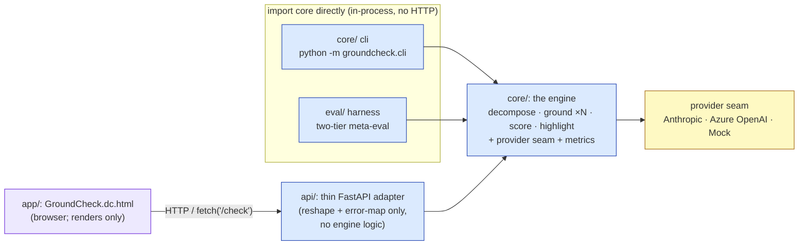
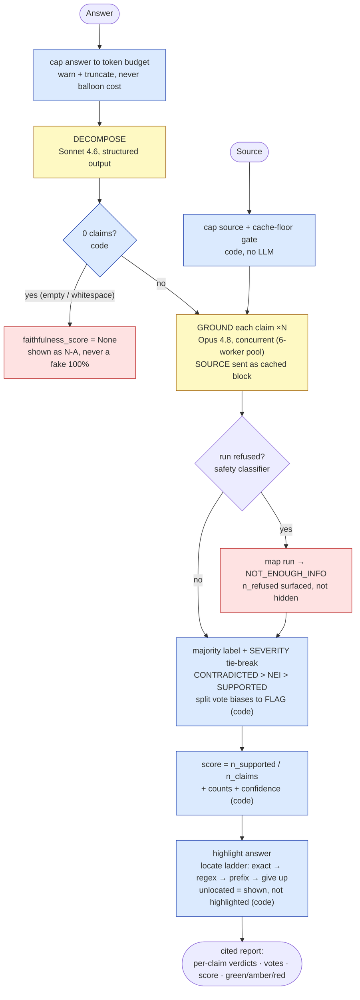
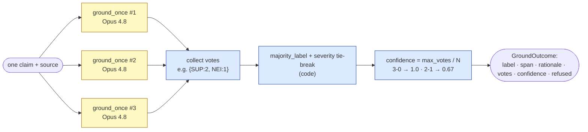
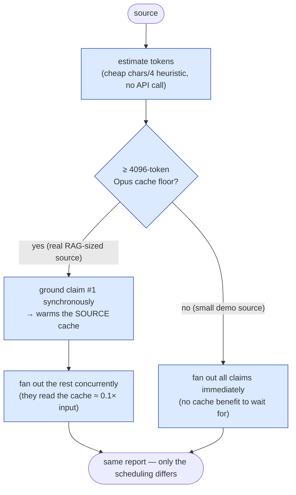
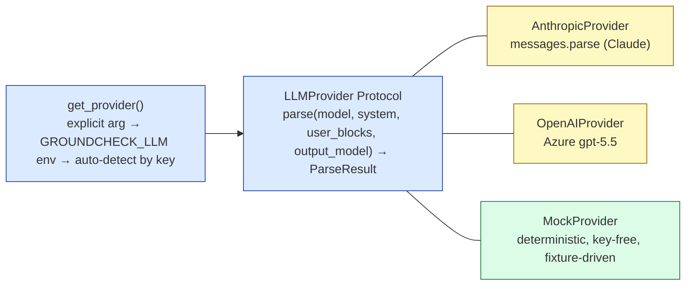
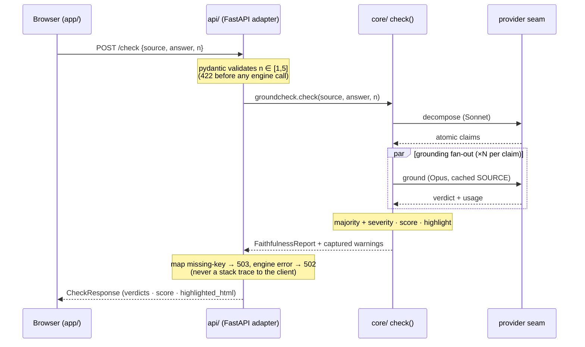
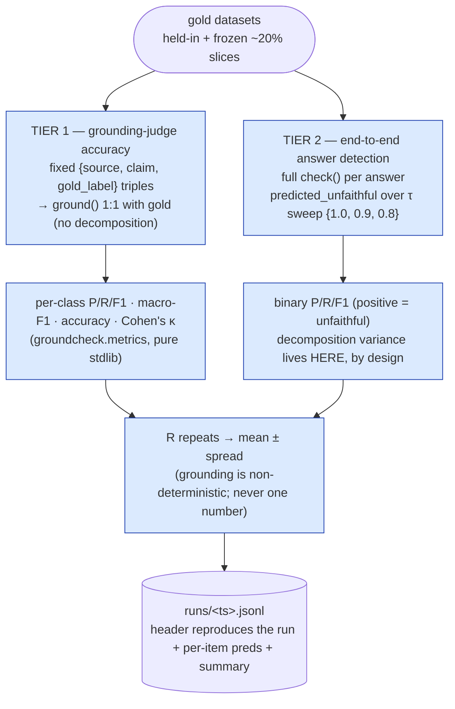
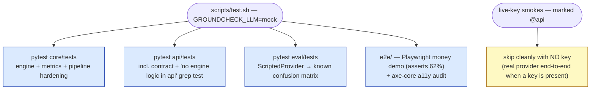

# Architecture

How the pieces fit, why they fit that way, and where the honesty is *enforced* rather
than asserted. For the product pitch and the leaderboard, see the
[root README](../README.md); for the meta-eval methodology, see [`eval.md`](eval.md).

> **Legend (used in every diagram below):**
> 🟦 deterministic (pure code — same input, same output) ·
> 🟨 LLM (distributional — N runs, never byte-stable) ·
> 🟥 honesty rail (degradation / N-A short-circuit — never a crash, never a wrong verdict).

---

## The load-bearing principle

**`core` is a plain importable Python module. Everything that *can* import it does so
directly — there is no service-to-service HTTP between Python components.** The CLI, the
FastAPI adapter, and the eval harness all call `from groundcheck import check` in-process.
The only component that talks HTTP is the browser, because a browser cannot import a Python
module.

That single rule is what makes the eval harness parallel-safe and the cost honest: there is
no network hop to mock, no service to stand up, and `check()` is a pure function of
`(source, answer)` plus a provider seam.



- **`core`** is the orchestrator (`pipeline.check`). `import groundcheck` pulls in only the
  data contracts and prompts — **never** `anthropic`/`openai` (both are lazy-imported inside
  the providers), so the package imports **key-free and fast**.
- **`api`** is a *thin* adapter: validate the request, call `check()`, capture engine
  warnings, map every error to clean JSON. It mounts the static `app/` **same-origin** under
  `/app`, so the page `fetch`es `/check` with no CORS. The "no grounding/scoring/highlighting
  logic in `api/`" rule is real discipline — `api/` never touches a verdict.
- **`app`** is the demo UI (no build step). It marks one span per claim and surfaces every
  edge state (loading, error, missing-key, N/A, refusal, borderline, unlocated).
- **`eval`** imports `core` directly, delegates **all** metric math to `groundcheck.metrics`,
  and is the only layer that ships the gold datasets (`pyyaml` is an eval-only dependency, so
  the engine stays dataset-free).

---

## The check pipeline

`check(source, answer)` is the whole product. It decomposes the answer into atomic claims,
grounds each claim **against the source only** N times, resolves a majority verdict with a
*flagging* bias, scores `SUPPORTED / n_claims`, and highlights the answer. The LLM steps are
distributional; everything around them is deterministic code — including every honesty rail.



Four decisions in that diagram carry the design:

1. **0 claims → `None`, not 100%.** An empty or whitespace answer (or one the model cannot
   decompose) short-circuits *before* any grounding call, with `cost_usd == 0.0`. The score
   is `None`, rendered as **N/A** — never a misleading "100% faithful" for an answer that
   said nothing.
2. **Grounding is fanned out, assembled in document order.** Claims ground concurrently in a
   6-worker pool, but results are slotted by claim index, so the report's order never depends
   on completion order. A single claim's grounding failure is logged and degraded to NEI — it
   never aborts the check.
3. **The tie-break biases toward flagging.** The majority vote is **not**
   `Counter.most_common` (arbitrary on ties). Among labels tied for the top count it returns
   the **most severe** present (`CONTRADICTED > NOT_ENOUGH_INFO > SUPPORTED`). A split vote
   flags; it never silently certifies a claim as grounded. That is the correct bias for a
   firewall.
4. **Highlighting is a soft link.** Locating a claim's sentence in the original answer is
   best-effort (exact → whitespace-tolerant regex → ~40-char prefix → give up). A sentence
   that can't be located is listed as *unlocated* and shown **unhighlighted** — it degrades
   to "claim shown, not highlighted," never to a wrong verdict.

### N-run majority — the determinism engine

Opus 4.8 rejects `temperature`/`top_p`/`top_k` and has no `seed`, so a single grounding call
is a coin flip on borderline claims. Determinism is *engineered*: each claim is grounded N
times (default 3) and resolved by majority with the severity tie-break.



---

## Caching: warm one call, then fan out

Within one check the judge sees the **same SOURCE** on every grounding call, so the SOURCE is
sent as a `cache_control: ephemeral` block. But a cache entry is only readable *after the
first response begins streaming*. So the pipeline runs a **cache gate**:



The 4096-token floor is why the small demo sources (~90 tokens) report
`cache_creation_input_tokens: 0` — that is expected, not a regression. The cache win
materializes on real RAG-sized contexts, where the N×claims grounding calls share one cached
SOURCE prefix.

---

## The provider seam

`core` talks to a model through one small `LLMProvider` Protocol (a single `parse()` method),
so the engine runs three ways without any branch in the pipeline:



- **`MockProvider`** is the default for every no-key test, CI, and the §5 worked-example
  demo. It returns canned, deterministic verdicts keyed on the (normalized) user text — and
  it can express a *split vote* as an ordered sequence of verdicts consumed by call index, so
  the 62% money demo reproduces byte-for-byte with no key.
- **`AnthropicProvider`** is the logical routing (decompose → Sonnet 4.6, ground → Opus 4.8).
- **`OpenAIProvider`** is what actually runs the live numbers in this environment, because the
  only key available here is Azure OpenAI (`gpt-5.5`). The logical Sonnet/Opus *routing* is
  unchanged; one Azure deployment serves both steps, and its cost figures are flagged as
  estimates (its list price is not in the pinned API facts).

Cost is honest by construction: every `parse()` returns a `Usage` with the three input
buckets (fresh / cache-write / cache-read) and output tokens, and `compute_cost` prices each
bucket separately. The per-check `cost_usd` includes the Sonnet decompose cost **plus** every
Opus grounding run — the decompose cost is never silently dropped.

---

## Request lifecycle (the web path)



---

## The two-tier meta-eval — the honesty headline

The hard part of any "LLM grader" is proving the grader itself is reliable. groundcheck ships
that proof as a **two-tier meta-eval** against human-labeled gold, with the two tiers split so
decomposition variance never silently corrupts a claim-level number. Full methodology,
datasets, and the τ-sweep rationale live in [`eval.md`](eval.md); the shape:



- **Tier 1** isolates the judge on fixed triples, so the detector label aligns 1:1 with gold —
  the rigorous headline. Decomposition is deliberately absent here.
- **Tier 2** runs the full pipeline and asks the answer-level question (*did we flag this as
  unfaithful?*) across a threshold sweep. Decomposition variance is folded in **here**, where
  it belongs.
- Grounding is non-deterministic, so every figure is **mean ± spread over R repeats**, never
  a single number pretending to be exact. The **frozen** slice (~20%, never tuned against) is
  reported as **accuracy + κ only** — at n≈9 the per-class F1 is too noisy to headline.

---

## Test tiers — deterministic vs live-key

The test suite mirrors the same honesty split as the eval: the bulk is **deterministic and
key-free**, and only a small set of smokes need a real key (and skip cleanly without one). It
is structurally hard for a missing key to turn a real failure into a green build.



The money demo (62%, three amber sentences) is asserted in `e2e/test_money_demo.py` against
the deterministic mock, so the headline figure is byte-stable and reproducible with no key.

---

## Invariants worth keeping

These are the properties the design protects; several are enforced by tests, not just
convention.

| Invariant | Why it matters | Where it's held |
|---|---|---|
| `import groundcheck` is key-free and SDK-free | the package loads fast and safe; no accidental network import | lazy SDK imports inside providers; asserted in `core/tests` |
| No service-to-service HTTP between Python components | eval stays parallel-safe; cost stays honest | everything imports `core` directly |
| No grounding/scoring/highlighting logic in `api/` | the adapter can't drift into a second engine | grep/contract test in `api/tests` |
| Split vote biases to **flag**, never certify | correct bias for a firewall | severity tie-break in `ground.py` |
| 0 claims → `None` (N/A), never 100% | an empty answer can't look perfectly faithful | `FaithfulnessReport.from_claims` |
| Refusals surfaced (`n_refused`), not hidden in the score | a safety refusal must not masquerade as a grounding result | `ground.py` → report counts |
| Per-check cost includes decompose **and** every grounding run | no silent under-counting | `pipeline.check` sums both |
| All metric math lives in `groundcheck.metrics` | one audited implementation of κ etc., reused by eval | `eval/` delegates, does no arithmetic |

---

## Repo layout

```text
core/    the engine + CLI + the metrics module (pure stdlib)    ·  from groundcheck import check
api/     FastAPI adapter over check(); serves the static app    ·  groundcheck_api.main:app
app/     the single-file dc-html demo UI (no build step)
eval/    the two-tier meta-eval harness + gold datasets         ·  python -m eval.run --tier all
scripts/ dev.* (serve the stack, no key)  ·  test.* (full no-key suite)
docs/    architecture.md (this file) · eval.md · the money-demo screenshot
```
