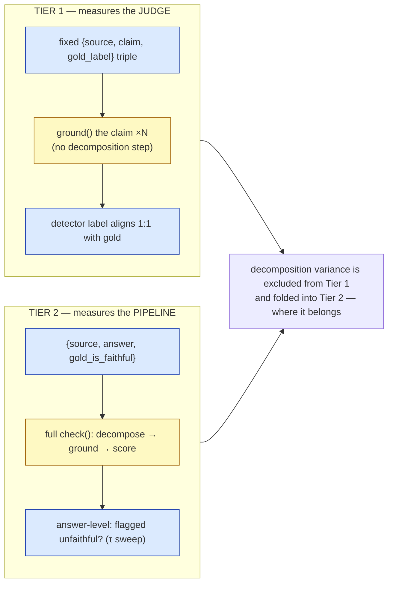
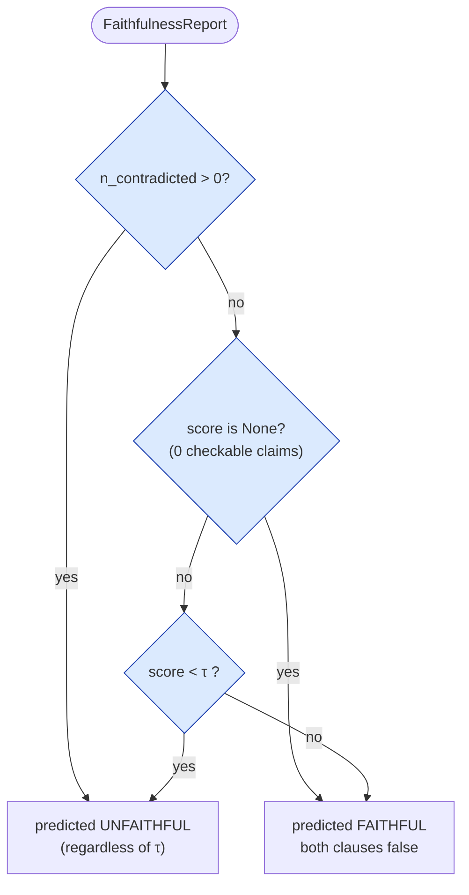
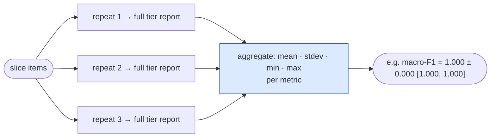
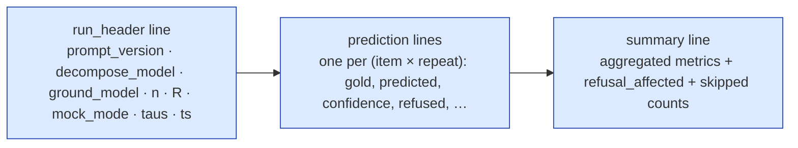

# The two-tier meta-eval

This is the part most "LLM graders" skip: a measurement of whether the detector's own
verdicts agree with **human labels**, reported honestly. The reliability of the tool is
*shown*, not asserted. This doc explains the methodology and the design choices behind it;
for the engine wiring see [`architecture.md`](architecture.md), and for how to run it see
[`../eval/README.md`](../eval/README.md).

> **Faithfulness is not truth.** Every metric here measures *"does the detector reproduce the
> author's grounding labels"* — not *"is the answer true in the world."* A statement that is
> true in reality but absent from the source is `NOT_ENOUGH_INFO` **by design**.

---

## Why two tiers (and not one claim-level number)

The naive approach — decompose an answer into claims and score each claim against a fixed
gold list — is broken at the root: **decomposition is itself an LLM step that varies run to
run**, so there is no stable per-claim ground truth to align to. Any "claim-level accuracy"
silently blends judge quality with decomposition wobble.

The fix is to split the measurement so each tier has clean ground truth:



- **Tier 1** feeds *fixed* claim triples straight into the judge, so the detector label aligns
  1:1 with gold. This is the rigorous headline — it measures the hard part (the judge) in
  isolation.
- **Tier 2** runs the whole pipeline end-to-end and asks the simpler question: *did we flag
  this answer as unfaithful?* Decomposition variance lives here, **by design** — Tier-2
  numbers blend judge quality and decomposition quality, and that is the honest place for it.

---

## Metrics (all from `groundcheck.metrics`, pure stdlib)

The eval harness does **no** P/R/F1/κ arithmetic of its own; it delegates everything to
`groundcheck.metrics`, a dependency-free module (hand-rolled Cohen's κ rather than a heavy ML
dependency). One audited implementation, reused by both tiers and unit-tested in isolation.

| Tier | Reported | Notes |
|---|---|---|
| Tier 1 (3-class) | per-class precision / recall / F1, **macro-F1**, accuracy, **Cohen's κ** | macro-F1 is the *unweighted* class mean — it punishes ignoring a rare class |
| Tier 2 (binary) | precision / recall / F1, accuracy | positive class = **unfaithful** (`gold = not gold_is_faithful`) |

Deliberate conventions (do not "fix" them): length-mismatch or empty input → `ValueError`;
`0/0 → 0.0` for P/R/F1 (so the tiny frozen slice doesn't crash when a class draws zero
predictions); the degenerate κ case (`pe == 1`) returns `1.0` on perfect agreement, else
`0.0`.

---

## The Tier-2 threshold sweep

Tier 2 needs a rule that turns a per-answer report into a binary *unfaithful?* decision. That
rule is:

```
predicted_unfaithful = (n_contradicted > 0) OR (score is not None AND score < τ)
```

swept over τ ∈ {1.0, 0.9, 0.8}, with **τ = 1.0 as the operating point**.



Two corner cases are pinned here on purpose:

- **(a)** the `n_contradicted > 0` clause flags a hard contradiction **regardless of τ**. At
  τ=1.0 it's redundant (any contradiction already drops the score below 1.0), but it is
  load-bearing at τ<1.0, where it stops one hard contradiction from being averaged away by
  many supported claims.
- **(b)** a `score is None` answer (0 checkable claims) is predicted **faithful**. Tier-2 gold
  cases therefore always carry ≥1 checkable claim, or are excluded.

**Why τ=1.0 is the operating point.** The one visible trade-off in the leaderboard is Tier-2
recall at the loose τ=0.8 (0.75 held-in): relaxing the threshold lets a mildly-unfaithful
answer slip through. A faithful paraphrase that adds any unstated-but-true detail yields an
NEI claim, so `score < 1.0` and it is flagged — a false positive the sweep makes visible.
The firewall's job is to flag, so the strict threshold is the right default.

---

## Distributional reporting: mean ± spread

Grounding is non-deterministic, so a single run is not a measurement. Each tier runs **R
repeats** (default R=3) and every figure is reported as **mean ± population stdev [min, max]**
— never a lone number pretending to be exact.



---

## Held-in vs frozen, and size honesty

Each dataset is split into a **held-in** slice and a **frozen** (~20%, stratified, never
tuned against) slice, reported **separately**:

- **held-in** headlines the full set: per-class P/R/F1 + macro-F1 + accuracy + κ.
- **frozen** (~9 items) headlines **accuracy + κ only**, with an explicit `n≈9, wide
  interval` caption. Per-class / macro-F1 are too noisy at that size to report — so they
  aren't. The frozen slice is a credible no-leakage sanity check, **not** a precise number.

---

## Datasets

| File | Shape | Size |
|---|---|---|
| `eval/datasets/tier1_claims.yaml` | `{source, claim, gold_label}` | ~45 triples, balanced 15/15/15 across 9 topics, ~20% frozen |
| `eval/datasets/tier2_answers.yaml` | `{source, answer, gold_is_faithful, bucket}` | ~18 answers across five buckets, ~20% frozen |

The five Tier-2 buckets — `fully_grounded`, `single_fabricated_stat`,
`direct_contradiction`, `faithful_paraphrase`, `mixed` — make the failure modes explicit. The
loader validates every entry against its tier's schema; a malformed item is **flagged and
skipped** (counted, never silently dropped), while structural problems that would corrupt
gold↔pred alignment (non-list file, duplicate id) raise. `t2-001`/`t2-002` are byte-identical
to the two `core/examples/*.json`, so the demo and the eval share ground truth.

> **Single-annotator gold.** Labels were authored and human-reviewed by **one** person, so κ
> measures **detector ↔ author** agreement, *not* inter-annotator reliability. The datasets
> are synthetic, bounded, and English-only. Perfect agreement means the detector reproduced
> the author's labels on these clean, single-annotator sets — it is **not** a claim of
> universal accuracy. Harder, real-world, multi-annotator data would expose gaps these sets
> do not.

---

## Reproducibility & persistence

Every run is persisted to `eval/runs/<ts>.jsonl` (gitignored), structured so the run is
reproducible from the file alone:



The `run_header` alone reproduces the run: it records `prompt_version`, both model IDs, `n`,
`R`, and `mock_mode`. The leaderboard in the root README is generated from one such persisted
run (`eval/runs/leaderboard.jsonl`).

---

## How to read the leaderboard honestly

The honest headline is *"Tier-1 macro-F1 = x, κ = y on the held-in set; frozen accuracy/κ
reported separately; Tier-2 P/R at τ=1.0,"* **never** *"catches all hallucinations."* See the
[root README leaderboard](../README.md#leaderboard) for the current numbers and the full
read-these-honestly caveat.
